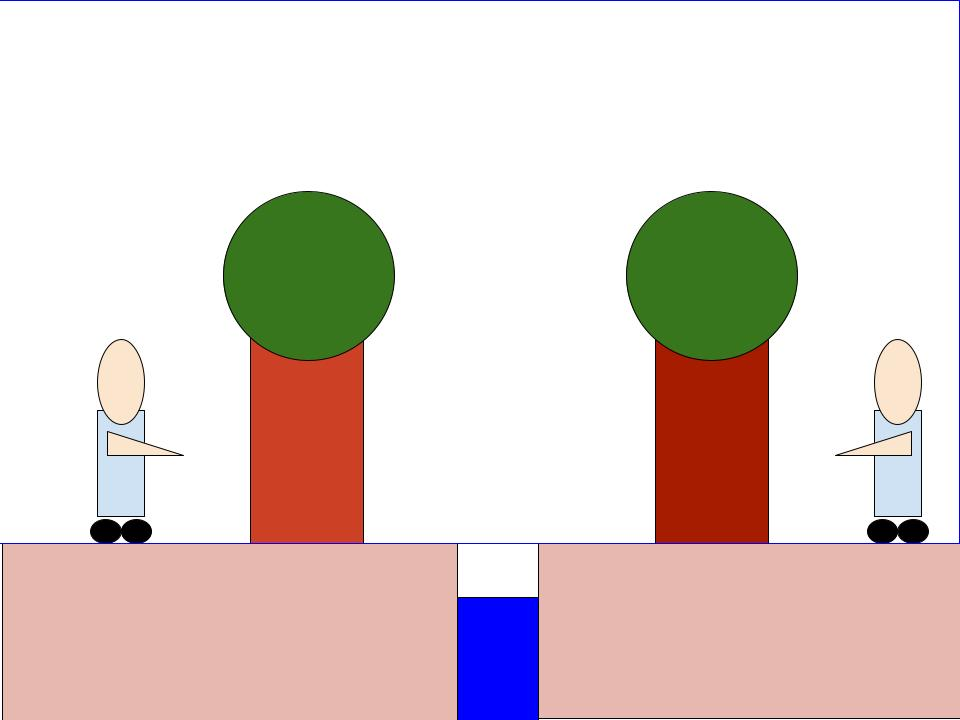

<!-- verwijzing naar p5.js -->

<!-- lib bestanden -->

<!-- game objecten -->

 

<!-- game class -->

<!-- p5 sketch -->

## De Opdracht

De opdracht was simpel, maak opnieuw een game. Dit keer was het de bedoeling dat we deze maakten aan de hand van klassen. Nadat mijn vorige spel mislukt was doordat ik te weinig code had, wou ik erin slagen om mezelf te overtreffen.

## Goede punten

Ik vind dat ik mezelf heb overtroffen. Ik heb een soort van game gemaakt, gebasseerd op de bekende Mario-spellen van Nintendo. De code heb ik geschreven met de hulp van die van de oefeningen uit de les. Voor de andere code heb ik enkele bronnen raadgepleegd online.

## Slechte punten

Zelf vind ik dat het spel nog niet af is. Er ontbreekt bijvoorbeeld een enorm belangrijk punt, een spelelement. Nu zou je kunnen zeggen dat het de bedoeling is dat de zogenaamde player in kwestie op het platform moet blijven en dat je er niet af moet vallen, maar dat is wat té simpel. Het originele concept was veel beter, je moet iemand redden en daarbij over water springen om aan de overkant te geraken, zoals aangegeven op de tekening hieronder. Nu ben ik doorheen de ontwikkeling van dit spel wat afgezwakt en wou ik het element van de persoon aan de overkant verwijderen. De player zou dan enkel nog over water moeten springen, maar ook dat bleek moeilijker te zijn dan gedacht. Ik hoop dan ook ten zeerste dat het mij toch nog zal lukken op één of andere manier.

