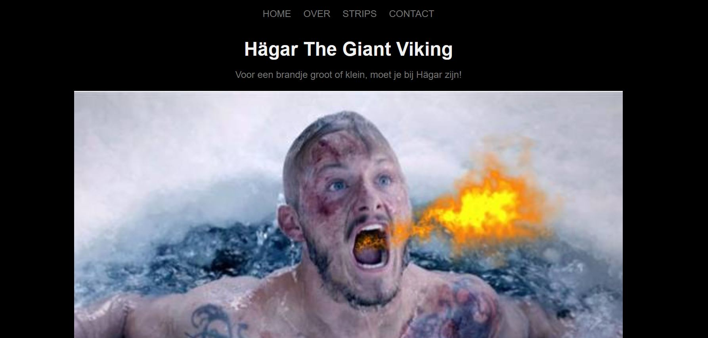

## De Opdracht

Wij kregen voor Informatica een nogal vreemde opdracht: trek een kaart uit het spel genaamd: 'Superfight', stel daarmee een superheld samen en maak er vervolgens een website van...

Zo gezegd, zo gedaan, ben ik eraan begonnen. De superheld die ik had gecreëerd was Hägar The Giant Viking. Een viking die vuur kon spuwen net zoals een draak en die de grootte had van een enorm appartementsgebouw.

## Goede punten

Ik was enorm trots op het feit dat mijn foto's de juiste grootte hadden gekregen en dat de kleuren allemaal klopten, zeker nadat ik er uren naar gezocht had. Het eindresultaat zelf vond ik niet slecht, maar ik had wel het gevoel dat er eventueel wat nood was aan verbetering.

## Slechtere punten

Het was voor mij een hele opgave in het begin om met CSS te werken, dus was ik voor alle zekerheid eens gaan kijken in andere projecten waarin we met CSS hadden gewerkt. Toen was er al sprake van wat schoonheidfoutjes zoals bv. een foto die over de tekst stond, ipv. eronder. Hetgene waar ik uiteindelijk het meeste moeite mee leek te hebben was met de 'Mobile-first'-ontwikkeling om het dan achteraf om te zetten naar een desktopversie. De elementen die op mijn website aanwezig waren, strookten in het begin niet, maar ik heb toch geprobeerd om er het beste van te maken. 

